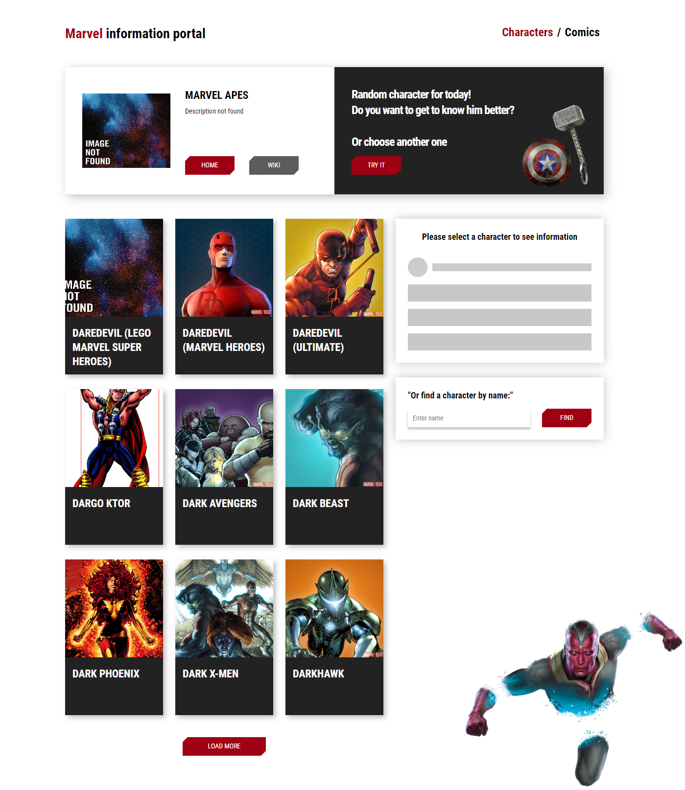
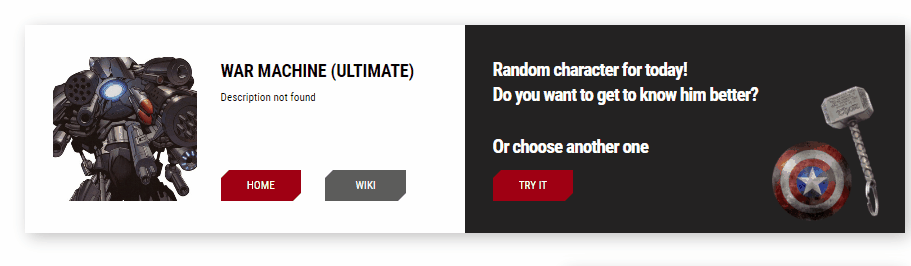
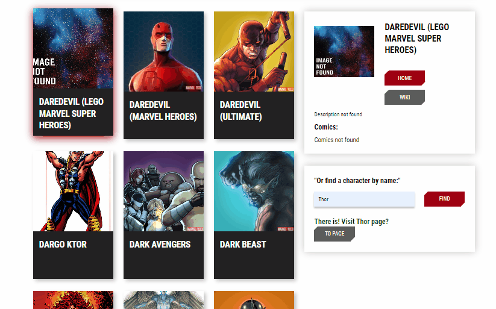
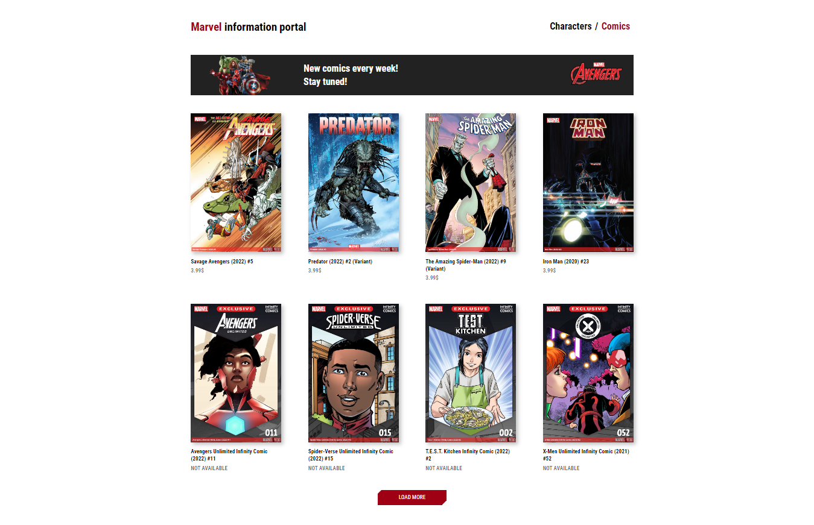
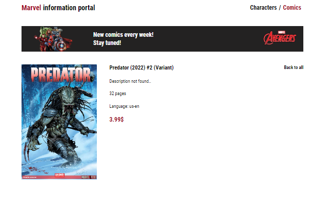

# Web site based on Marvel API

## Description: site for viewing heroes and comics related to the Marvel Cinematic Universe
---
## Dependencies:
- react
- react-router-dom
- react-hook-form
- yup
- sass
- prop-types

## Screenshots and gifs of the site
- Main Page
     

- Random character
     

- Character info
     

- Comics page
     
- Single comics
     
## How to copy and run a project 

`$ git clone https://github.com/Danylo-Liniychuk/Marvel_Frontend` 

`$ npm i` 

`$ npm start`
